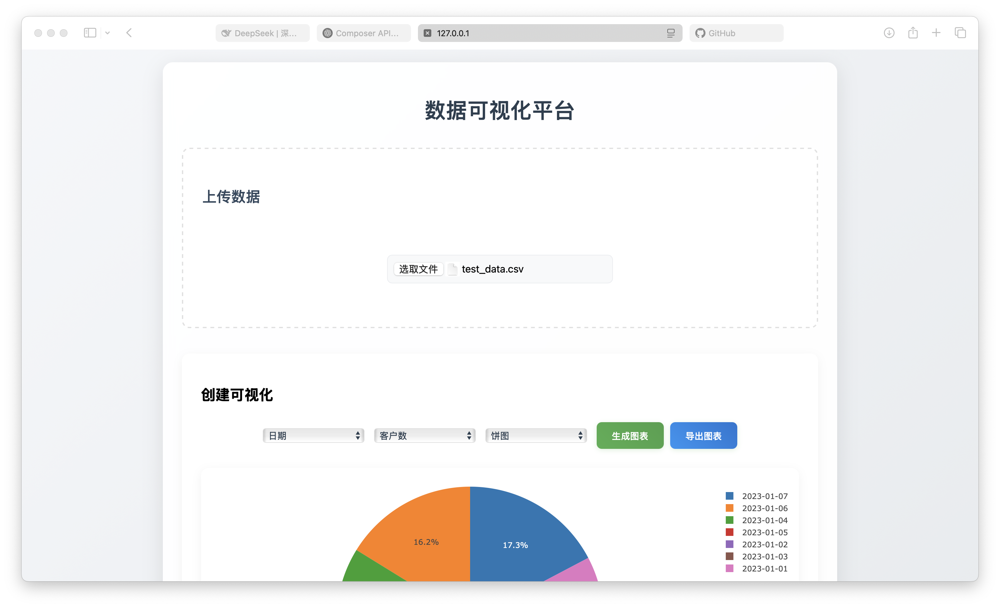

# 数据可视化平台

## 项目简介

本项目是一个基于 Flask 的数据可视化平台，用户可以上传自己的数据文件（CSV 或 Excel 格式），选择数据中的列进行可视化，并生成相应的图表。该平台支持多种图表类型，包括散点图、柱状图、折线图和饼图。用户还可以编辑上传的数据，并实时更新图表。

## 功能

- **文件上传**：支持上传 CSV 和 Excel 文件。
- **数据可视化**：根据用户选择的列生成不同类型的图表。
- **实时更新**：用户可以编辑表格数据，图表会自动更新。
- **导出图表**：用户可以将生成的图表导出为 PNG 格式的图片。
- **数据表格**：展示上传的数据，并允许用户进行编辑。

## 技术栈

- **后端**：Flask (Jinja2 模板引擎)
- **数据处理**：Pandas
- **前端**：HTML, CSS, JavaScript, Plotly.js

## 运行环境

- Python 版本：`>=3.8`
- 操作系统：Windows / macOS / Linux
- 依赖管理：使用 `pip` 进行依赖管理

## 使用说明

### 1. **安装依赖**

在项目根目录下运行以下命令安装所需的 Python 库：

```bash
pip install -r requirements.txt
```

### 2. **运行应用**

在项目根目录下运行以下命令启动 Flask 应用：

```bash
python app.py
```

如果需要调试模式，可使用：

```bash
export FLASK_ENV=development  # macOS/Linux
set FLASK_ENV=development     # Windows
python app.py
```

### 3. **访问应用**

打开浏览器，访问 `http://localhost:5000`。

### 4. **上传数据**

点击“选取文件”按钮，选择 CSV 或 Excel 文件进行上传。


### 5. **生成图表**

选择 X 轴和 Y 轴数据列，选择图表类型，然后点击“生成图表”按钮。


### 6. **导出图表**

点击“导出图表”按钮，将生成的图表保存为 PNG 图片。

## API 端点

| 方法 | 端点 | 说明 |
|------|------|------|
| `POST` | `/upload` | 上传数据文件 |
| `GET`  | `/data` | 获取已上传数据 |
| `POST` | `/update` | 更新表格数据 |
| `GET`  | `/chart` | 获取生成的图表 |

## 文件结构

```
project/
├── app.py                  # Flask 应用主文件
├── requirements.txt        # Python 依赖文件
├── static/
│   ├── css/
│   │   └── style.css       # 样式文件
│   └── js/
│       └── main.js         # JavaScript 文件
├── templates/
│   └── index.html          # 主页面模板
├── uploads/                # 上传文件存储目录（需手动创建 `.gitkeep` 以便 Git 追踪）
└── stock_data.csv          # 示例股票数据文件（可删除或替换）
```

## 调试与错误处理

如果 Flask 运行失败，请检查：
- 是否正确安装了所有依赖：`pip list`
- 端口是否被占用（默认为 `5000`）
- 终端是否显示 `ModuleNotFoundError`（可能需要重新安装依赖）

## 贡献

欢迎任何形式的贡献！如果你有建议或发现了问题，请提交 issue 或 pull request。

