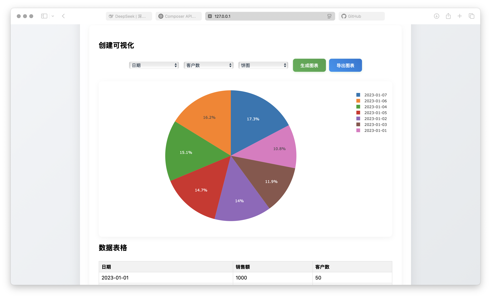

# Data Visualization Platform
[Chinese Version](readme-Chinese.md)
## Project Overview

This project is a Flask-based data visualization platform that allows users to upload their own data files (in CSV or Excel format), select columns from the data for visualization, and generate corresponding charts. The platform supports various chart types, including scatter plots, bar charts, line charts, and pie charts. Users can also edit the uploaded data and see real-time updates to the charts.

## Features

- **File Upload**: Supports uploading CSV and Excel files.
- **Data Visualization**: Generates different types of charts based on user-selected columns.
- **Real-time Updates**: Users can edit table data, and the charts will update automatically.
- **Export Charts**: Users can export the generated charts as PNG images.
- **Data Table**: Displays the uploaded data and allows users to edit it.

## Tech Stack

- **Backend**: Flask (with Jinja2 template engine)
- **Data Processing**: Pandas
- **Frontend**: HTML, CSS, JavaScript, Plotly.js

## Environment Requirements

- Python Version: `>=3.8`
- Operating System: Windows / macOS / Linux
- Dependency Management: Use `pip` for dependency management

## Usage Instructions

### 1. **Install Dependencies**

Run the following command in the project root directory to install the required Python libraries:

```bash
pip install -r requirements.txt
```

### 2. **Run the Application**

Run the following command in the project root directory to start the Flask application:

```bash
python app.py
```

For debugging mode, you can use:

```bash
export FLASK_ENV=development  # macOS/Linux
set FLASK_ENV=development     # Windows
python app.py
```

### 3. **Access the Application**

Open your browser and go to `http://localhost:5000`.

### 4. **Upload Data**

Click the "Choose File" button to select a CSV or Excel file for upload.


### 5. **Generate Charts**

Select the X-axis and Y-axis data columns, choose the chart type, and then click the "Generate Chart" button.


### 6. **Export Charts**

Click the "Export Chart" button to save the generated chart as a PNG image.

## API Endpoints

| Method | Endpoint | Description |
|--------|----------|-------------|
| `POST` | `/upload` | Upload data file |
| `GET`  | `/data`   | Retrieve uploaded data |
| `POST` | `/update` | Update table data |
| `GET`  | `/chart`  | Retrieve generated chart |

## File Structure

```
project/
├── app.py                  # Main Flask application file
├── requirements.txt        # Python dependencies file
├── static/
│   ├── css/
│   │   └── style.css       # Stylesheet
│   └── js/
│       └── main.js         # JavaScript file
├── templates/
│   └── index.html          # Main page template
├── uploads/                # Directory for uploaded files (create a `.gitkeep` file to track with Git)
└── stock_data.csv          # Sample stock data file (can be deleted or replaced)
```

## Debugging and Error Handling

If Flask fails to run, please check:
- Whether all dependencies are correctly installed: `pip list`
- If the port is occupied (default is `5000`)
- If the terminal shows `ModuleNotFoundError` (may need to reinstall dependencies)

## Contribution

Contributions of any kind are welcome! If you have suggestions or find issues, please submit an issue or pull request.